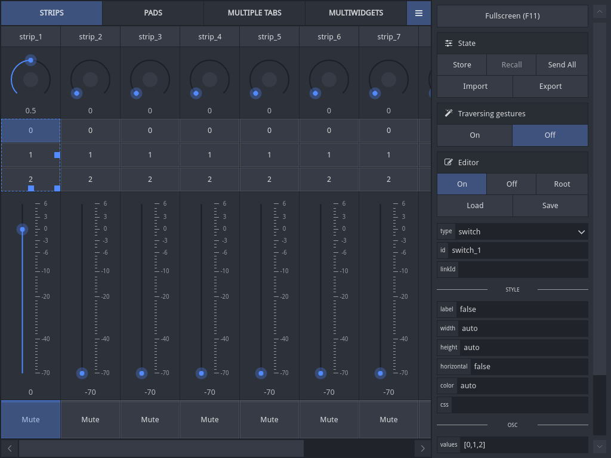

#  <small> Open Stage Control </small>

----

<a class="btn btn-primary btn-sm" href="https://github.com/jean-emmanuel/open-stage-control/releases"><i class="fa fa-download fa-fw"></i> ...</a>
<a class="btn btn-info btn-sm" href="http://openstagecontrol.herokuapp.com/"><i class="fa fa-bolt fa-fw"></i> Demo</a>
<a class="btn btn-default btn-sm pull-right" href="https://github.com/jean-emmanuel/open-stage-control"><i class="fa fa-star fa-fw"></i> ...</a>

----

Open Stage Control is a libre desktop OSC bi-directionnal control surface application. It's built with HTML, JavaScript & CSS and run as a Node / [Electron](http://electron.atom.io/) web server that accepts any number of Chrome / Chromium / Electron clients.

## Demo

You can try the app here [http://openstagecontrol.herokuapp.com/](http://openstagecontrol.herokuapp.com/)

Please note that :

- Chrome/Chromium **49** at least is required
- Since there is only one instance running, all connected guests are synchronized (widgets using the same osc paths update each other's states) : you might experience some unwanted synchronization with other users unless you specify custom parameters for your widgets.
- You might want to download the examples sessions files under *examples/* and load them in the app to get started.

## Features

- mouse & multi-touch sensitive widgets
- modular & responsive layout
- built-in live editor
- bi-directionnal osc bindings
- headless server mode with any number of clients using chromium
- app state store / recall & import / export
- themes !

## Supported platforms

Same as [Electron's supported platforms](https://github.com/electron/electron/blob/master/docs/tutorial/supported-platforms.md)

## License & credits

Copyleft © Jean-Emmanuel @ [AMMD](http://ammd.net). This program is released under the GNU/GPL3 license.

It relies on the use of several libraries :

- [Node.js](https://nodejs.org/)
- [Electron](http://electron.atom.io/)
- [osc.js](https://github.com/colinbdclark/osc.js)
- [socket.io](http://socket.io)
- [browserify](http://browserify.org)
- [express](http://expressjs.com)
- [node-sass](https://github.com/sass/node-sass)
- [jQuery](http://jquery.com/)
- [jQuery-UI](http://jqueryui.com/) (draggable, resizable & sortable)
- [Font Awesome](http://fontawesome.io/)
