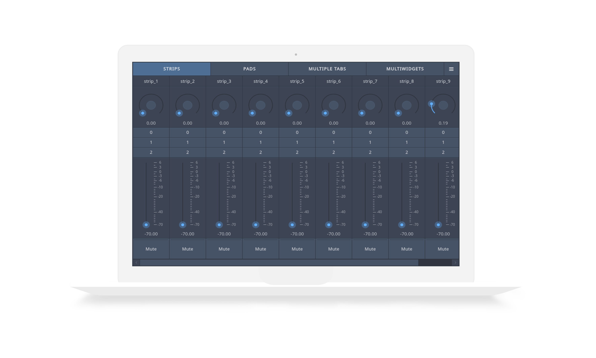

# Open Stage Control

Open Stage Control is a libre desktop OSC bi-directionnal control surface application. It's built on web technologies and run as an [Electron](http://electron.atom.io/) web server that accepts any number of clients.

[Try the online demo (chrome 49 required)](http://demo.osc.ammd.net)

[Download the latest release](https://github.com/jean-emmanuel/open-stage-control/releases)

## Supported platforms

The server can run on all [platforms supported by Electron](https://github.com/electron/electron/blob/master/docs/tutorial/supported-platforms.md). Any client that can run chrome browser can connect to the server.
